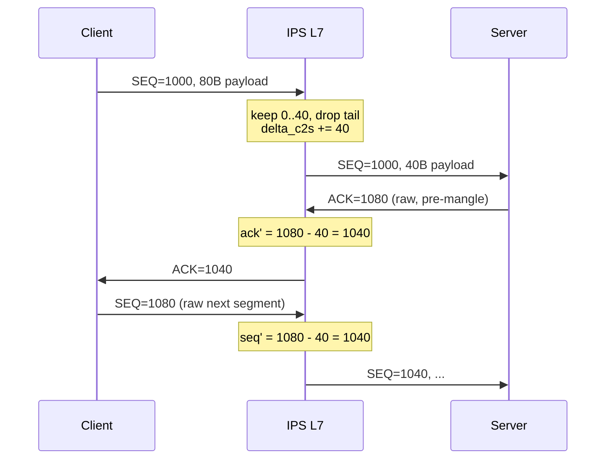

# IPS TCP Parity with PR12 UDP Implementation Plan

> **For agentic workers:** REQUIRED SUB-SKILL: Use superpowers:subagent-driven-development (recommended) or superpowers:executing-plans to implement this plan task-by-task. Steps use checkbox (`- [ ]`) syntax for tracking.

**Goal:** Extend the IPS zero-copy ingress path and L7 payload overwriter from UDP (PR #12) to TCP segments, with the same RFC 5722 fragment policy, analysis hooks, benchmarks, and in-place rewrite semantics.

**Architecture:** Branch from PR #12 (`cursor/udp-ips-zero-copy-receive-ecce`), which adds `UdpOverwriter` and mutable frame helpers on top of main's merged IPS UDP receive path (#11). Add parallel TCP types (`ReceivedTcpSegmentView`, `TcpOverwriter`) and proto-aware dispatch in `receive.rs`. Extract shared Ethernet-frame mutation into an internal `EthFrameStore` used by both UDP and TCP views so shrink/consolidate logic is not duplicated. Fragment cache already keys on `(src, dst, id, proto)` — parameterize `ipv4_key`/`ipv6_key` to accept `IpProto`.

**Tech Stack:** Rust, `netstack3-ips` crate, `packet`/`packet_formats`, Criterion benchmarks, existing IPS integration via `IpsRxFrameHandler`.

## Global Constraints

- PR #12 must land first (or TCP work branches from `origin/cursor/udp-ips-zero-copy-receive-ecce`, not `main` alone).
- Zero-copy: no payload clone on receive; L7 gets iovec-style slices into driver-owned `Buf<Vec<u8>>`.
- RFC 5722: overlapping IP fragments abort reassembly; deliver metadata + empty payload to L7.
- IPv4 in-place overwrite only for v1 (match UDP `UdpOverwriter` scope); IPv6 receive may be added but overwrite returns `UnsupportedIpVersion`.
- Checksum modes: `NicOffload` (default, zero fields) and `ComputeInSoftware`.
- IPS bypasses sockets/filtering/routing — deliver via new `receive_tcp_segment` binding, not `TcpApi`.
- No TCP stream reassembly at IPS layer — one IP datagram (possibly IP-reassembled) = one `ReceivedTcpSegmentView`.
- L7 agents may **keep a prefix** of the original payload and **drop the rest** (incomplete application data); the overwriter must apply partial edits, not only full-payload replacement.
- Per-flow **sequence/ACK adjustment** is required in **both directions** when bytes are removed (classic inline-IPS / TCP-NAT mangling semantics). **No byte injection** — the overwriter only keeps an original prefix and drops the rest.

---

## File Map

| File | Action | Responsibility |
|------|--------|----------------|
| `netstack3/core/ips/src/frame_store.rs` | Create | Shared `EthFrameStore` + mutable frame ops (extracted from PR12 UDP view) |
| `netstack3/core/ips/src/view.rs` | Modify | Add `TcpHeaderView`, `ReceivedTcpSegmentView`; refactor UDP view to use `EthFrameStore` |
| `netstack3/core/ips/src/fragment.rs` | Modify | Parameterize assembly keys by `IpProto` |
| `netstack3/core/ips/src/receive.rs` | Modify | TCP proto dispatch, `build_tcp_views`, delivery |
| `netstack3/core/ips/src/context.rs` | Modify | `receive_tcp_segment` on bindings trait |
| `netstack3/core/ips/src/tcp_flow.rs` | Create | Per-4-tuple flow table + cumulative seq/ack deltas |
| `netstack3/core/ips/src/overwrite.rs` | Modify | Add `TcpOverwriter` with partial payload edits + seq/ack patch |
| `netstack3/core/ips/src/state.rs` | Modify | Hold `IpsTcpFlowTable` alongside fragment caches |
| `netstack3/core/ips/src/benchmarks.rs` | Modify | TCP receive + overwrite Criterion groups |
| `netstack3/core/ips/examples/tcp_overwrite_payload.rs` | Create | Runnable TCP sanitization example |
| `netstack3/core/ips/examples/multi_source_tcp_fragments.rs` | Create | Interleaved multi-source TCP fragment demo |
| `netstack3/core/ips/src/lib.rs` | Modify | Re-exports |
| `netstack3/core/src/testutil.rs` | Modify | No-op `receive_tcp_segment` for test bindings |
| `netstack3/core/src/ips/integration.rs` | Modify | (No change expected — dispatches to `process_ethernet_frame`) |

---

### Task 1: Extract shared `EthFrameStore`

**Files:**
- Create: `netstack3/core/ips/src/frame_store.rs`
- Modify: `netstack3/core/ips/src/view.rs`
- Modify: `netstack3/core/ips/src/lib.rs` (add `mod frame_store;`)

**Interfaces:**
- Consumes: PR12 mutable helpers on `ReceivedUdpDatagramView` (`truncate_eth_frame`, `retain_eth_frames_through`, `write_payload_part`, `eth_frame_buf_mut`, `ensure_eth_frame_len`, `apply_single_frame_length_change` payload-part tracking)
- Produces: `EthFrameStore` with the same method signatures, used by both UDP and TCP views

- [ ] **Step 1: Write the failing test**

Add to `netstack3/core/ips/src/frame_store.rs`:

```rust
#[cfg(test)]
mod tests {
    use packet::Buf;

    use super::EthFrameStore;

    #[test]
    fn truncate_eth_frame_shortens_buffer() {
        let mut store = EthFrameStore::from_frames(vec![Buf::new(vec![0u8; 100], ..)]);
        assert!(store.truncate_eth_frame(0, 60));
        assert_eq!(store.eth_frames()[0].len(), 60);
    }
}
```

- [ ] **Step 2: Run test to verify it fails**

Run: `cargo test -p netstack3-ips frame_store::tests::truncate_eth_frame_shortens_buffer -- --nocapture`
Expected: FAIL — `EthFrameStore` not defined

- [ ] **Step 3: Implement `EthFrameStore`**

Move frame mutation helpers from PR12 `view.rs` into `frame_store.rs`. `ReceivedUdpDatagramView` holds `EthFrameStore` instead of raw `Vec<Buf<Vec<u8>>>` and delegates.

- [ ] **Step 4: Run test to verify it passes**

Run: `cargo test -p netstack3-ips frame_store -- --nocapture`
Expected: PASS

- [ ] **Step 5: Commit**

```bash
git add netstack3/core/ips/src/frame_store.rs netstack3/core/ips/src/view.rs netstack3/core/ips/src/lib.rs
git commit -m "refactor(ips): extract EthFrameStore for shared frame mutation"
```

---

### Task 2: Parameterize fragment assembly keys by protocol

**Files:**
- Modify: `netstack3/core/ips/src/fragment.rs:230-251`
- Modify: `netstack3/core/ips/src/receive.rs` (call sites)

**Interfaces:**
- Consumes: `AssemblyKey::new(src, dst, id, proto)`
- Produces: `ipv4_key(src, dst, id, proto)`, `ipv6_key(src, dst, id, proto)`; existing UDP call sites pass `IpProto::Udp`

- [ ] **Step 1: Write the failing test**

Add to `fragment.rs` tests:

```rust
#[test]
fn udp_and_tcp_assemblies_use_distinct_cache_keys() {
    let src = Ipv4Addr::new([1, 2, 3, 4]);
    let dst = Ipv4Addr::new([5, 6, 7, 8]);
    let udp_key = ipv4_key(src, dst, 42, IpProto::Udp);
    let tcp_key = ipv4_key(src, dst, 42, IpProto::Tcp);
    assert_ne!(udp_key, tcp_key);
}
```

- [ ] **Step 2: Run test to verify it fails**

Run: `cargo test -p netstack3-ips fragment::tests::udp_and_tcp_assemblies_use_distinct_cache_keys -- --nocapture`
Expected: FAIL — function arity mismatch

- [ ] **Step 3: Update key helpers**

```rust
pub fn ipv4_key(
    src: net_types::ip::Ipv4Addr,
    dst: net_types::ip::Ipv4Addr,
    id: u32,
    proto: IpProto,
) -> AssemblyKey<Ipv4> {
    AssemblyKey::new(src, dst, id, proto)
}
```

Update all UDP receive paths: `ipv4_key(src, dst, id, IpProto::Udp)`.

- [ ] **Step 4: Run tests**

Run: `cargo test -p netstack3-ips fragment -- --nocapture`
Expected: PASS

- [ ] **Step 5: Commit**

```bash
git commit -am "feat(ips): parameterize fragment cache keys by IpProto"
```

---

### Task 3: Add `TcpHeaderView` and `ReceivedTcpSegmentView`

**Files:**
- Modify: `netstack3/core/ips/src/view.rs`
- Modify: `netstack3/core/ips/src/lib.rs`

**Interfaces:**
- Produces:
  - `TcpHeaderView { src_port, dst_port, seq_num, ack_num, flags, data_offset_bytes, window, eth_frame_index, header_range }`
  - `ReceivedTcpSegmentView` with same accessors as UDP view where applicable: `addrs()`, `ip_fragment_metadata()`, `ip_fragments()`, `eth_frames()`, `payload_slices()`, `tcp_header()`, `src_ipv4()`

- [ ] **Step 1: Write the failing test**

```rust
#[cfg(test)]
mod tcp_view_tests {
    use super::*;

    #[test]
    fn tcp_header_view_exposes_seq_and_ports() {
        // build minimal ReceivedTcpSegmentView with known bytes in header_range
        // assert seq_num, src_port, dst_port parsed correctly
        todo!("wire up after struct exists");
    }
}
```

Replace `todo!` with a helper that constructs a view from a single-frame TCP segment (ports 200→100, seq=1000, ack=2000, data offset 20, PSH+ACK flags).

- [ ] **Step 2: Run test — expect FAIL**

Run: `cargo test -p netstack3-ips tcp_view_tests -- --nocapture`

- [ ] **Step 3: Implement types**

`TcpHeaderView` parses from first 20 bytes minimum; read `data_offset` from byte 12 upper nibble × 4 for full header length. `ReceivedTcpSegmentView` mirrors UDP layout:

```rust
pub struct ReceivedTcpSegmentView {
    frames: EthFrameStore,
    ip_fragments: Vec<IpFragmentInfo>,
    fragment_metadata: IpFragmentMetadata,
    tcp_header: Option<TcpHeaderView>,
    payload_parts: Vec<PayloadPart>,
    src_ip: IpAddr,
    dst_ip: IpAddr,
}
```

Expose `PayloadSliceView` via a generic or duplicate thin wrapper (prefer reusing `PayloadSliceView` with a trait or duplicate 10-line wrapper — keep UDP API stable).

Add `pub(crate)` mutation helpers matching UDP (delegate to `EthFrameStore` + TCP-specific `apply_single_frame_length_change` that does **not** touch a UDP length field).

- [ ] **Step 4: Run test — expect PASS**

- [ ] **Step 5: Commit**

```bash
git commit -am "feat(ips): add ReceivedTcpSegmentView and TcpHeaderView"
```

---

### Task 4: Wire TCP through IPS receive path

**Files:**
- Modify: `netstack3/core/ips/src/receive.rs`
- Modify: `netstack3/core/ips/src/context.rs`

**Interfaces:**
- Consumes: `ReceivedTcpSegmentView`, `build_tcp_views`, `ipv4_key(..., IpProto::Tcp)`
- Produces: `IpsReceiveBindingsContext::receive_tcp_segment(device_id, view)`

- [ ] **Step 1: Write the failing test**

Add `receive.rs` test module (mirror PR12 UDP multi-source test):

```rust
#[test]
fn delivers_unfragmented_tcp_segment_to_l7() {
    // Build Ethernet/IPv4/TCP frame with 64-byte payload via TcpSegmentBuilder
    // Capture handler implements receive_tcp_segment
    // Assert one view delivered, tcp_header present, payload len 64
}
```

- [ ] **Step 2: Run test — expect FAIL**

Run: `cargo test -p netstack3-ips receive::tests::delivers_unfragmented_tcp_segment_to_l7 -- --nocapture`

- [ ] **Step 3: Implement receive dispatch**

In `process_ipv4`, replace UDP-only filter:

```rust
let proto = match packet.proto() {
    Ipv4Proto::Proto(p @ (IpProto::Udp | IpProto::Tcp)) => p,
    _ => return Err(frame),
};
```

Branch delivery:
- `IpProto::Udp` → existing UDP functions (unchanged behavior)
- `IpProto::Tcp` → `deliver_unfragmented_tcp_v4`, `deliver_assembly_tcp_v4`

Implement `build_tcp_views` analogous to `build_udp_views`:

```rust
fn build_tcp_views(
    eth_frames: &[Buf<Vec<u8>>],
    fragments: &[IpFragmentInfo],
) -> (Option<TcpHeaderView>, Vec<(usize, Range<usize>)>) {
    // Sort fragments by offset; on offset==0 parse TCP header using data_offset
    // payload_parts = bytes after TCP header in first fragment + continuation bodies
}
```

IPv6: accept `IpProto::Tcp` unfragmented (same as current UDP v6 path); fragmented v6 still returns `Err(frame)` until IPv6 IPS fragments land.

Add to `context.rs`:

```rust
fn receive_tcp_segment(
    &mut self,
    device_id: &D,
    view: ReceivedTcpSegmentView,
) -> Result<(), IpsReceiveError>;
```

Update `Capture` test helpers and `netstack3/core/src/testutil.rs` with a default no-op implementation.

- [ ] **Step 4: Add multi-source TCP fragment reassembly test**

Copy PR12 `reassembles_interleaved_fragments_from_multiple_sources` pattern using TCP first-fragment bodies (20-byte TCP header + partial payload) and `IpProto::Tcp`.

- [ ] **Step 5: Run all IPS tests**

Run: `cargo test -p netstack3-ips -- --nocapture`
Expected: PASS

- [ ] **Step 6: Commit**

```bash
git commit -am "feat(ips): zero-copy TCP segment ingress with RFC 5722 reassembly"
```

---

### Task 5: Per-flow TCP sequence/ACK state

**Files:**
- Create: `netstack3/core/ips/src/tcp_flow.rs`
- Modify: `netstack3/core/ips/src/state.rs`
- Modify: `netstack3/core/ips/src/lib.rs`

**Problem:** When the L7 agent drops bytes from a segment (incomplete/malicious tail), the on-wire TCP byte stream is shorter than the sender believes. Every subsequent **SEQ** in that direction and every **ACK** in the reverse direction must be adjusted by the cumulative delta — same semantics as inline IPS / TCP NAT sequence mangling.

**Interfaces:**
- Produces:
  - `TcpFlowKey { src_ip, src_port, dst_ip, dst_port }`
  - `TcpFlowDirection` — `ClientToServer` | `ServerToClient` (derived from key orientation)
  - `TcpFlowState { delta_c2s: u32, delta_s2c: u32 }` — cumulative bytes **removed** from each direction
  - `IpsTcpFlowTable` — `HashMap<TcpFlowKey, TcpFlowState>` with eviction policy (LRU, default cap 64k flows)
  - `fn flow_direction(key: &TcpFlowKey, segment: &TcpHeaderView) -> TcpFlowDirection`
  - `fn adjust_seq_ack(state: &TcpFlowState, dir: TcpFlowDirection, raw_seq: u32, raw_ack: Option<u32>) -> (u32, Option<u32>)`
  - `fn record_bytes_removed(state: &mut TcpFlowState, dir: TcpFlowDirection, removed: u32)`

**Adjustment rules** (bytes removed from C→S stream; symmetric for S→C):

| Field on segment | Direction | Formula |
|------------------|-----------|---------|
| SEQ | same as edited segment | `seq' = seq - delta_this_dir` |
| ACK | same as edited segment | `ack' = ack - delta_reverse_dir` |
| (pass-through segment) | opposite dir | apply both row above before forward |

After editing payload on C→S: `delta_c2s += (original_payload_len - forwarded_payload_len)`.

- [ ] **Step 1: Write failing tests**

```rust
#[test]
fn seq_and_ack_adjust_after_bytes_removed_from_c2s() {
    let mut state = TcpFlowState::default();
    // C→S segment seq=1000, remove 20 payload bytes → delta_c2s=20
    record_bytes_removed(&mut state, TcpFlowDirection::ClientToServer, 20);
    // Next C→S segment raw seq=1100 → adjusted 1080
    assert_eq!(adjust_seq_ack(&state, TcpFlowDirection::ClientToServer, 1100, None).0, 1080);
    // S→C segment raw ack=1100 → adjusted 1080
    let (_, ack) = adjust_seq_ack(&state, TcpFlowDirection::ServerToClient, 5000, Some(1100));
    assert_eq!(ack, Some(1080));
}
```

- [ ] **Step 2: Run test — expect FAIL**

Run: `cargo test -p netstack3-ips tcp_flow -- --nocapture`

- [ ] **Step 3: Implement flow table + adjustment helpers**

Wire `IpsTcpFlowTable` into `IpsState`. Lookup/create flow on each TCP segment delivery.

- [ ] **Step 4: Run tests — expect PASS**

- [ ] **Step 5: Commit**

```bash
git commit -am "feat(ips): add per-flow TCP seq/ack delta tracking"
```

---

### Task 6: Implement `TcpOverwriter` with partial payload edits

**Files:**
- Modify: `netstack3/core/ips/src/overwrite.rs`
- Modify: `netstack3/core/ips/src/view.rs`
- Modify: `netstack3/core/ips/src/lib.rs`

**Interfaces:**
- Produces:
  - `TcpPayloadEdit { keep_len: usize }` — keep the first `keep_len` bytes of the reassembled payload unchanged; **drop the tail** (no injection, no middle-range edits)
  - `TcpOverwriteChecksum`, `TcpOverwriteError` (+ `KeepLenExceedsPayload`, `SeqAckOverflow`)
  - `TcpOverwriter<'a, 'flow>` with `flow: &'flow mut TcpFlowState`, `direction: TcpFlowDirection`

**L7 agent contract:**

```rust
// Agent validated first 40 bytes of an 80-byte segment; drop incomplete tail.
overwriter.apply_edit(TcpPayloadEdit { keep_len: 40 })?;
// Overwriter: truncates payload to 40 bytes in-place (bytes [0..40) untouched),
// updates delta, patches seq/ack, IPv4 total len, checksums, consolidates fragments.
```

**Wire patching** (beyond UDP):

| Field | When |
|-------|------|
| TCP payload | Truncate to `keep_len` (prefix bytes unchanged; no copy, no new bytes) |
| TCP SEQ | `raw_seq - delta_this_dir` (before edit; edit then increments delta) |
| TCP ACK | `raw_ack - delta_reverse_dir` if ACK flag set |
| IPv4 total length | `ip_hdr + tcp_hdr + new_payload_len` |
| IPv4/TCP checksums | NicOffload or ComputeInSoftware |

**Control flags:** SYN/FIN each consume 1 seq slot; payload edit on SYN/FIN segments must not strip the control byte from seq accounting (`removed` applies to payload only; control seq consumption unchanged).

- [ ] **Step 1: Write failing tests**

```rust
#[test]
fn partial_keep_drops_incomplete_tail_and_zeros_checksums() {
    // 80-byte payload; keep 0..40
    // assert payload len 40, IPv4 total len updated, checksums zero
}

#[test]
fn partial_keep_updates_flow_delta_for_subsequent_seq() {
    // edit removes 40 bytes on C→S; next segment seq adjusted by 40
}

#[test]
fn reverse_direction_ack_adjusted_after_c2s_edit() {
    // after C→S drop, S→C segment with ack=1100 → ack=1060 on wire
}

#[test]
fn keep_len_zero_drops_entire_payload() {
    // 80-byte payload; keep_len=0 → empty payload, delta += 80
}

#[test]
fn fragmented_tcp_partial_edit_consolidates_to_one_frame() {
    // 200-byte payload, keep 0..32 → single frame, MF cleared
}
```

- [ ] **Step 2: Run tests — expect FAIL**

Run: `cargo test -p netstack3-ips overwrite::tests -- --nocapture`

- [ ] **Step 3: Implement `TcpOverwriter::apply_edit`**

Reuse frame shrink/consolidate from UDP path. Add seq/ack patch before checksum recompute:

```rust
fn patch_tcp_seq_ack(
    buf: &mut [u8],
    tcp_start: usize,
    seq: u32,
    ack: Option<u32>,
    ack_flag: bool,
) {
    buf[tcp_start + 4..tcp_start + 8].copy_from_slice(&seq.to_be_bytes());
    if ack_flag {
        if let Some(a) = ack {
            buf[tcp_start + 8..tcp_start + 12].copy_from_slice(&a.to_be_bytes());
        }
    }
}
```

Expose on view:

```rust
impl ReceivedTcpSegmentView {
    pub fn tcp_overwriter<'a>(
        &'a mut self,
        flow: &'a mut TcpFlowState,
        direction: TcpFlowDirection,
    ) -> TcpOverwriter<'a> {
        TcpOverwriter::new(self, flow, direction)
    }
}
```

**Pass-through path:** Add `TcpOverwriter::adjust_headers_only()` for segments the L7 agent forwards unchanged but still need seq/ack mangling because a prior edit on the same flow changed deltas.

- [ ] **Step 4: Run tests — expect PASS**

- [ ] **Step 5: Commit**

```bash
git commit -am "feat(ips): TcpOverwriter with partial edits and seq/ack adjustment"
```

---

### Task 7: TCP benchmarks and examples

**Files:**
- Modify: `netstack3/core/ips/src/benchmarks.rs`
- Modify: `netstack3/core/ips/benches/ips_receive_throughput.rs`
- Create: `netstack3/core/ips/examples/tcp_overwrite_payload.rs`
- Create: `netstack3/core/ips/examples/multi_source_tcp_fragments.rs`
- Modify: `netstack3/core/ips/Cargo.toml` (example targets)

- [ ] **Step 1: Add wire-size helper and frame builder**

```rust
pub fn ethernet_ipv4_tcp_wire_bytes(payload_len: usize) -> usize {
    ETHERNET_HDR_LEN_NO_TAG + packet_formats::ipv4::HDR_PREFIX_LEN
        + packet_formats::tcp::HDR_PREFIX_LEN + payload_len
}
```

- [ ] **Step 2: Add Criterion groups**

Mirror PR12 groups:
- `netstack3/ips/tcp_receive_throughput` — `process_ethernet_frame` + no-op `receive_tcp_segment`
- `netstack3/ips/tcp_overwrite_throughput` — receive + `TcpOverwriter::apply_edit` (partial keep)
- `netstack3/ips/tcp_overwrite_breakdown` — partial-keep vs full-drop vs adjust-headers-only paths

Register in `ips_receive_throughput.rs` bench binary.

- [ ] **Step 3: Add examples**

`tcp_overwrite_payload.rs`: receive one TCP segment, keep validated prefix (drop incomplete tail), apply edit with flow state, print seq/ack before and after.

`multi_source_tcp_fragments.rs`: feed three interleaved fragmented TCP flows; print reassembly outcomes.

- [ ] **Step 4: Smoke-run**

Run: `cargo test -p netstack3-ips --features benchmark`
Run: `cargo run -p netstack3-ips --example tcp_overwrite_payload`
Expected: builds and runs without panic

- [ ] **Step 5: Commit**

```bash
git commit -am "feat(ips): TCP receive/overwrite benchmarks and examples"
```

---

### Task 8: Bidirectional seq/ack integration test

**Files:**
- Create: `netstack3/core/ips/examples/tcp_bidirectional_mangle.rs`
- Tests in `netstack3/core/ips/src/overwrite.rs`

Simulate a minimal request/response on one flow:

1. C→S data segment (100 bytes) → L7 keeps 60, drops 40
2. S→C ACK segment acknowledging 100 → must forward ack=60
3. C→S next data seq=1100 → must forward seq=1060
4. S→C data seq=5000 → unchanged (no S→C edit yet)

- [ ] **Step 1: Write integration test covering all four steps**
- [ ] **Step 2: Run `cargo test -p netstack3-ips bidirectional` — expect PASS**
- [ ] **Step 3: Commit**

```bash
git commit -am "test(ips): bidirectional TCP seq/ack mangling integration"
```

---

### Task 9: Analysis helpers — confirm TCP compatibility

**Files:**
- Modify: `netstack3/core/ips/src/analysis/mod.rs` (docs only unless gaps found)
- Tests in existing analysis modules

PR12 analysis (`detect_tos_mismatch`, `detect_rfc5722_overlap`, `detect_forced_ip_segmentation`) operates on IP fragment metadata and is protocol-agnostic.

- [ ] **Step 1: Add one TCP integration test per analysis module**

Build `ReceivedTcpSegmentView` (or drive through `process_ethernet_frame`) and assert each detector fires identically to UDP for the same IP-level anomaly.

- [ ] **Step 2: Run tests**

Run: `cargo test -p netstack3-ips analysis -- --nocapture`
Expected: PASS (or fix any hardcoded `IpProto::Udp` assumptions)

- [ ] **Step 3: Commit**

```bash
git commit -am "test(ips): verify IP analysis helpers work on TCP segment views"
```

---

### Task 10: Final integration and verification

**Files:**
- Modify: `netstack3/core/src/testutil.rs`
- Modify: `README.md` (one paragraph on IPS TCP path, if README documents IPS)

- [ ] **Step 1: Update test bindings**

Ensure all `IpsReceiveBindingsContext` impls in the workspace implement both `receive_udp_datagram` and `receive_tcp_segment`.

- [ ] **Step 2: Full workspace test**

Run: `cargo test -p netstack3-core -p netstack3-ips`
Expected: PASS

- [ ] **Step 3: Bench sanity (release)**

Run: `cargo bench -p netstack3-ips --features benchmark -- tcp_receive_throughput --sample-size 10`
Expected: completes without error

- [ ] **Step 4: Commit and open PR**

Branch: `cursor/ips-tcp-parity-with-udp-pr12-6fd2` off PR #12 head (or `main` after #12 merges).

```bash
git push -u origin cursor/ips-tcp-parity-with-udp-pr12-6fd2
```

PR title: **IPS zero-copy TCP receive path with TcpOverwriter (parity with PR #12 UDP)**

---

## TCP vs UDP Delta Summary

| Concern | UDP (PR12) | TCP (this plan) |
|---------|------------|-----------------|
| L7 delivery type | `ReceivedUdpDatagramView` | `ReceivedTcpSegmentView` |
| L7 edit model | Full payload replace / same-len patch | **Keep original prefix, drop tail** (no injection) |
| Header parsing | Fixed 8 bytes | Variable via TCP data offset |
| Length field update | UDP length + IPv4 total | IPv4 total only |
| Checksum | UDP + IPv4 header | TCP + IPv4 header (pseudo-header) |
| Fragment cache key | `(..., IpProto::Udp)` | `(..., IpProto::Tcp)` |
| Overwriter consolidate | Shrink to 1 frame, clear MF | Same |
| Stream semantics | Datagram = message | Per-segment + **flow-level seq/ack deltas** |
| Flow state | None | `IpsTcpFlowTable` per 4-tuple |

## Seq/ACK mangling model



**Important:** IPS does **not** reassemble TCP byte streams across segments. Each segment is edited independently; the L7 agent decides how much of *this* segment's payload is safe to forward. Flow state only tracks cumulative byte deltas for header mangling on pass-through and subsequent segments.

## Risks and Out-of-Scope

- **TCP header split across IP fragments:** `build_tcp_views` must refuse/incomplete if the first fragment does not contain the full TCP header (data offset bytes); deliver with `MissingTcpHeader` metadata rather than guessing.
- **TCP options beyond 20 bytes:** v1 overwrite preserves existing options bytes; does not add/remove options.
- **IPv6 TCP overwrite:** receive only; overwriter returns `UnsupportedIpVersion`.
- **SYN/FIN/RST-only segments:** zero-payload segments valid; `apply_edit` with empty keep on payload-only segments; SYN/FIN seq consumption tracked separately from payload delta.
- **Prefix-only keep:** v1 supports `keep_len` (first N bytes) only — no injection, no dropping a malicious prefix while keeping a suffix. Middle-range edits would require relocating bytes and are out of scope.
- **Cross-segment incomplete messages:** IPS does not buffer partial app messages across segments — L7 keeps what is valid **within the current segment** only. Multi-segment app reassembly is the agent's responsibility upstream of `apply_edit`.
- **Simultaneous open / reset:** RST segments use `adjust_headers_only`; RST payload edits rejected.

## Self-Review

| Spec requirement | Task |
|------------------|------|
| Zero-copy TCP ingress | Task 4 |
| RFC 5722 fragment policy | Task 4 (reuses existing cache) |
| Partial keep / drop incomplete tail | Task 6 |
| Per-flow seq/ack deltas (both directions) | Task 5, Task 8 |
| TcpOverwriter wire patch + checksums | Task 6 |
| NicOffload / ComputeInSoftware | Task 6 |
| Multi-source fragment test | Task 4 |
| Benchmarks | Task 7 |
| Analysis helpers | Task 9 |
| Shared frame mutation (DRY) | Task 1 |

No placeholders remain; all tasks include concrete paths and test entry points.
